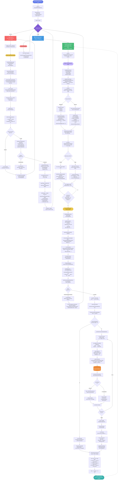

# SAMM ERP — Tek Sayfa Akış Şeması (Login → Oracle DB)

> Markdown Preview Mermaid Support uzantısı ile görselleştirin.

```mermaid
flowchart TD
    %% ═══════════════════════════════════════════
    %% BAŞLANGIÇ
    %% ═══════════════════════════════════════════
    START(["🌐 Kullanıcı uygulamayı açar"])
    START --> MAIN["main.tsx\nReactDOM.createRoot()"]
    MAIN --> PROVIDERS["BrowserRouter → AuthProvider\n— sessionStorage'dan token okunur —"]
    PROVIDERS --> APP["App.tsx render"]

    %% ═══════════════════════════════════════════
    %% TOKEN KONTROL
    %% ═══════════════════════════════════════════
    APP --> TOKEN_CHECK{"🔑 token var mı?\nuseAuth().token"}

    %% ═══════════════════════════════════════════
    %% LOGIN SAYFASI
    %% ═══════════════════════════════════════════
    TOKEN_CHECK -- "❌ YOK" --> LOGIN_PAGE["📄 LoginPage.tsx\nstate: email, password, error, loading"]
    LOGIN_PAGE --> FORM_FILL["Kullanıcı email + şifre girer\nsetEmail() / setPassword()"]
    FORM_FILL --> SUBMIT_BTN(["🖱️ Giriş Yap butonuna basar"])
    SUBMIT_BTN --> HANDLE_SUBMIT["handleSubmit(e) çalışır\ne.preventDefault()\nsetError('')\nsetLoading(true)"]

    %% ═══════════════════════════════════════════
    %% API CALL — LOGIN
    %% ═══════════════════════════════════════════
    HANDLE_SUBMIT --> API_POST["api.post('/auther/login', {email, password})\n— api.ts Axios instance —"]
    API_POST --> REQ_INTERCEPTOR["⚙️ Axios Request Interceptor\nsessionStorage.getItem('token')\n→ İlk login: token yok, header eklenmez"]
    REQ_INTERCEPTOR --> HTTP_POST["📡 HTTP POST\nhttp://localhost:3000/auther/login\nBody: {email, password}"]

    %% ═══════════════════════════════════════════
    %% BACKEND — AUTH
    %% ═══════════════════════════════════════════
    HTTP_POST --> EXPRESS["⚙️ Express Server - index.ts\napp.use('/auther', authRoutes)"]
    EXPRESS --> AUTH_ROUTE["AuthRoutes.ts\nrouter.post('/login')"]
    AUTH_ROUTE --> AUTH_CTRL["AuthController.login(req, res)\n1. req.body → {email, password}\n2. Validasyon: boş alan var mı?"]

    AUTH_CTRL --> VALID_CHECK{"email & password\ndolu mu?"}
    VALID_CHECK -- "❌ Eksik" --> ERR_400["res.status(400)\n{message: 'eksik alan'}"]
    ERR_400 --> LOGIN_ERR

    VALID_CHECK -- "✅ Dolu" --> AUTH_SVC["AuthService.login(email, password)\n1. EnvGetUsers() → .env'den kullanıcılar\n2. users.find(email && password eşleşmesi)"]

    AUTH_SVC --> USER_FOUND{"Kullanıcı\nbulundu mu?"}
    USER_FOUND -- "❌ Bulunamadı" --> ERR_401["res.status(401)\n{message: 'yanlış email veya şifre'}"]
    ERR_401 --> LOGIN_ERR["⬅️ Frontend catch bloğu\nsetError(message)\nsetLoading(false)"]
    LOGIN_ERR --> LOGIN_PAGE

    USER_FOUND -- "✅ Bulundu" --> GEN_TOKEN["generateToken(user)\npayload: {id, user: name}\njwt.sign(payload, JWT_SECRET, {expiresIn:'1h'})"]
    GEN_TOKEN --> RES_200["res.json({success:true, token: 'ey...'})\n⬅️ HTTP 200"]

    %% ═══════════════════════════════════════════
    %% FRONTEND — TOKEN KAYIT
    %% ═══════════════════════════════════════════
    RES_200 --> SAVE_TOKEN["LoginPage: res.data.token alınır\nAuthContext.login(token) çağrılır"]
    SAVE_TOKEN --> CTX_LOGIN["AuthContext — login() fonksiyonu\n1. sessionStorage.setItem('token', token)\n2. setToken(token)\n3. parseToken(token) → base64 decode\n4. setUser({id, user})"]
    CTX_LOGIN --> NAVIGATE["navigate('/') çağrılır\n→ App.tsx yeniden render"]
    NAVIGATE --> TOKEN_CHECK

    %% ═══════════════════════════════════════════
    %% ANA SAYFA — LAYOUT
    %% ═══════════════════════════════════════════
    TOKEN_CHECK -- "✅ VAR" --> LAYOUT["🖥️ Authenticated Layout\nHeader: SAMM ERP + user.user + Çıkış Yap"]
    LAYOUT --> UPDATE_PAGE["📄 UpdateProductPage.tsx\n/urun-guncelle route\nstate: operation, envId, items,\nrawText, results, loading"]

    %% ═══════════════════════════════════════════
    %% ÇIKIŞ YAPMA
    %% ═══════════════════════════════════════════
    LAYOUT --> LOGOUT_BTN(["🚪 Çıkış Yap butonu"])
    LOGOUT_BTN --> LOGOUT_FN["AuthContext.logout()\n1. sessionStorage.removeItem('token')\n2. setToken(null)\n3. setUser(null)"]
    LOGOUT_FN --> TOKEN_CHECK

    %% ═══════════════════════════════════════════
    %% ADIM 1 — İŞLEM TÜRÜ SEÇ
    %% ═══════════════════════════════════════════
    UPDATE_PAGE --> STEP1["🔽 ADIM 1: OperationSelectorComponent\nDropdown açılır: stock / location"]
    STEP1 --> SELECT_OP(["Kullanıcı 'Stok Güncelle' seçer"])
    SELECT_OP --> OP_HANDLER["handleSelect('stock')\n→ onChange('stock') parent'a bildirir\n→ setOpen(false) dropdown kapanır"]
    OP_HANDLER --> OP_STATE["UpdateProductPage:\nhandleOperationChange('stock')\nsetOperation('stock')\nsetItems(prev → tüm value'lar sıfırlanır)"]

    %% ═══════════════════════════════════════════
    %% ADIM 2 — ID GİRİŞİ
    %% ═══════════════════════════════════════════
    OP_STATE --> STEP2["📝 ADIM 2: ItemIdInputComponent\nEnv ID + Textarea + Excel Yükle"]

    STEP2 --> ID_METHOD{"ID giriş yöntemi?"}

    ID_METHOD -- "⌨️ Manuel" --> MANUAL["Textarea'ya yazar:\nPRD-001\nPRD-002\nPRD-003"]
    MANUAL --> TEXT_HANDLER["handleTextChange(v)\n1. onRawTextChange(v)\n2. parseIds(v) → split(virgül/newline)\n3. dedupeItems() → tekrarları sil\n4. onItemsChange([{id,value:''},..])"]

    ID_METHOD -- "📊 Excel" --> EXCEL["Excel Yükle butonuna basar\n.xlsx/.csv dosya seçer"]
    EXCEL --> EXCEL_HANDLER["handleExcel(e)\n1. file.arrayBuffer()\n2. XLSX.read(buffer)\n3. sheet_to_json (A:ID, B:Değer)\n4. dedupeItems([...eski, ...yeni])\n5. onItemsChange(combined)"]

    TEXT_HANDLER --> ITEMS_READY["items[] state güncellendi\nChip'ler gösterilir: PRD-001, PRD-002, ..."]
    EXCEL_HANDLER --> ITEMS_READY

    %% ═══════════════════════════════════════════
    %% ADIM 3 — DEĞER GİRİŞİ
    %% ═══════════════════════════════════════════
    ITEMS_READY --> STEP3["✏️ ADIM 3: NewValueInputCompanent\noperation && items.length > 0 ise render"]
    STEP3 --> VAL_METHOD{"Değer giriş yöntemi?"}

    VAL_METHOD -- "Tek tek" --> SINGLE_VAL["Her satır için input'a değer girer"]
    SINGLE_VAL --> SINGLE_HANDLER["handleItemValueChange(id, newValue)\nitems.map(item.id===id → value güncelle)\nonItemsChange(updated)"]

    VAL_METHOD -- "Toplu" --> BULK_VAL["Bulk input'a '50' yazar\n'Tümüne Uygula' butonuna basar"]
    BULK_VAL --> BULK_HANDLER["handleHandleApply()\nitems.map(item → {...item, value:'50'})\nonItemsChange(updated)"]

    SINGLE_HANDLER --> VALUES_READY["Tüm değerler girildi\nallValuesFilled = true ✅"]
    BULK_HANDLER --> VALUES_READY

    %% ═══════════════════════════════════════════
    %% ADIM 4 — GÜNCELLE BUTONU
    %% ═══════════════════════════════════════════
    VALUES_READY --> CAN_SUBMIT{"canSubmit?\noperation ✅\nitems.length > 0 ✅\nallValuesFilled ✅\n!loading ✅"}
    CAN_SUBMIT -- "❌" --> VALUES_READY
    CAN_SUBMIT -- "✅" --> UPDATE_BTN(["🖱️ '3 Ürün Güncelle' butonuna basar"])

    UPDATE_BTN --> HANDLE_UPDATE["handleUpdate() çalışır\nsetResults([])\nsetLoading(true)"]

    %% ═══════════════════════════════════════════
    %% PAYLOAD OLUŞTURMA & API CALL
    %% ═══════════════════════════════════════════
    HANDLE_UPDATE --> BUILD_PAYLOAD["payload oluşturur:\nitems.map(item → {\n  id: item.id,\n  [operation]: item.value\n})\n→ [{id:'PRD-001',stock:'50'}, ...]"]
    BUILD_PAYLOAD --> API_PATCH["api.patch('/products/bulk', payload)"]
    API_PATCH --> REQ_INT2["⚙️ Axios Request Interceptor\ntoken = sessionStorage.getItem('token')\nheaders.Authorization = 'Bearer ey...'"]
    REQ_INT2 --> HTTP_PATCH["📡 HTTP PATCH\nhttp://localhost:3000/products/bulk\nHeaders: Authorization: Bearer ey...\nBody: [{id,stock}, ...]"]

    %% ═══════════════════════════════════════════
    %% BACKEND — MIDDLEWARE
    %% ═══════════════════════════════════════════
    HTTP_PATCH --> EXPRESS2["⚙️ Express Server\napp.use('/products', productRoutes)"]
    EXPRESS2 --> PROD_ROUTE["ProducutRoutes.ts\nrouter.use(securityMiddleware)"]
    PROD_ROUTE --> AUTH_MW["AuthMiddleware — securityMiddleware()\n1. req.headers['authorization'] oku\n2. 'Bearer ey...' → split(' ')[1] → token"]
    AUTH_MW --> MW_CHECK["authService.CheckTicket(token)\njwt.verify(token, JWT_SECRET)"]

    MW_CHECK --> MW_VALID{"Token\ngeçerli mi?"}
    MW_VALID -- "❌ Geçersiz/Süresi dolmuş" --> MW_401["res.status(401)\n'Biletin sahte veya süresi dolmuş!'"]
    MW_401 --> RES_INT["⚙️ Axios Response Interceptor\nstatus 401 yakalanır\nsessionStorage.removeItem('token')\nwindow.location.href = '/login'"]
    RES_INT --> TOKEN_CHECK

    MW_VALID -- "✅ Geçerli" --> MW_NEXT["req.user = {id, user}\nnext() → sonraki handler"]

    %% ═══════════════════════════════════════════
    %% BACKEND — CONTROLLER
    %% ═══════════════════════════════════════════
    MW_NEXT --> BULK_ROUTE["router.patch('/bulk')\n→ productController.bulkUpdate(req, res)"]
    BULK_ROUTE --> PROD_CTRL["ProductController.bulkUpdate()\nitems = req.body"]
    PROD_CTRL --> CTRL_VALID{"Array.isArray(items)\n&& items.length > 0?"}
    CTRL_VALID -- "❌" --> CTRL_400["res.status(400)\n{message:'Güncellenecek ürün bulunamadı'}"]
    CTRL_400 --> API_ERR["Frontend catch bloğu\nsetResults([{id:'-', success:false, message}])"]
    API_ERR --> SHOW_RESULTS

    CTRL_VALID -- "✅" --> PROD_SVC["productService.bulkUpdate(items)"]

    %% ═══════════════════════════════════════════
    %% BACKEND — SERVICE & ORACLE
    %% ═══════════════════════════════════════════
    PROD_SVC --> LOOP_START["🔄 for (item of items) döngüsü başlar\n{id, ...fields} = item"]
    LOOP_START --> MAP_COLS["ALLOWED_COLUMNS eşleştirme:\n'stock' → 'STOCK'\n'location' → 'LOCATION'"]
    MAP_COLS --> BUILD_SQL["SQL oluşturma:\nUPDATE PRODUCTS\nSET STOCK = :stock\nWHERE ID = :id"]
    BUILD_SQL --> DB_CONN["getConnection()\noracledb.getConnection(oracleConfig)\n— .env: ORACLE_USER, PASS, CONNECT_STRING —"]
    DB_CONN --> ORACLE[("🗄️ Oracle Database\nPRODUCTS Tablosu")]
    ORACLE --> EXECUTE["connection.execute(sql, bind, {autoCommit:true})"]

    EXECUTE --> ROWS_CHECK{"rowsAffected\n> 0 ?"}
    ROWS_CHECK -- "❌ 0 satır" --> DB_ERR["Error: 'PRD-001 kodlu ürün\nOracle da bulunamadı'"]
    DB_ERR --> PUSH_FAIL["results.push({id, success:false, message})"]
    ROWS_CHECK -- "✅ Güncellendi" --> PUSH_OK["results.push({id, success:true,\nmessage:'başarıyla güncellendi'})"]

    PUSH_FAIL --> CLOSE_CONN["connection.close()"]
    PUSH_OK --> CLOSE_CONN
    CLOSE_CONN --> NEXT_ITEM{"Sonraki item\nvar mı?"}
    NEXT_ITEM -- "✅ Var" --> LOOP_START
    NEXT_ITEM -- "❌ Bitti" --> RETURN_RESULTS["return results[]\nUpdateResult[] döner"]

    %% ═══════════════════════════════════════════
    %% RESPONSE DÖNÜŞÜ
    %% ═══════════════════════════════════════════
    RETURN_RESULTS --> CTRL_RES["ProductController\nres.json(results)"]
    CTRL_RES --> HTTP_RES["📡 HTTP 200\n[{id,success,message}, ...]"]
    HTTP_RES --> RES_INT2["⚙️ Axios Response Interceptor\nstatus 200 → response olduğu gibi geçer"]
    RES_INT2 --> FE_RESULT["UpdateProductPage\nsetResults(res.data)\nsetLoading(false)"]

    %% ═══════════════════════════════════════════
    %% SONUÇ GÖSTERİMİ
    %% ═══════════════════════════════════════════
    FE_RESULT --> SHOW_RESULTS["📊 ResultLogComponent\nprops: results, loading"]
    SHOW_RESULTS --> RESULT_RENDER["Her sonuç satırı render edilir:\n✅ PRD-001 — başarıyla güncellendi\n✅ PRD-002 — başarıyla güncellendi\n❌ PRD-003 — Oracle'da bulunamadı"]
    RESULT_RENDER --> SUMMARY["Özet: ✓ 2 başarılı · ✗ 1 hata"]
    SUMMARY --> END_STATE(["✅ İşlem tamamlandı\nKullanıcı yeni güncelleme yapabilir"])
    END_STATE -.-> UPDATE_PAGE

    %% ═══════════════════════════════════════════
    %% STİLLER
    %% ═══════════════════════════════════════════
    style START fill:#667eea,color:#fff,stroke:#5a67d8
    style LOGIN_PAGE fill:#f56565,color:#fff,stroke:#e53e3e
    style UPDATE_PAGE fill:#48bb78,color:#fff,stroke:#38a169
    style ORACLE fill:#ed8936,color:#fff,stroke:#dd6b20
    style TOKEN_CHECK fill:#805ad5,color:#fff,stroke:#6b46c1
    style END_STATE fill:#38b2ac,color:#fff,stroke:#319795
    style LAYOUT fill:#4299e1,color:#fff,stroke:#3182ce
    style SUBMIT_BTN fill:#ecc94b,color:#1a202c,stroke:#d69e2e
    style UPDATE_BTN fill:#ecc94b,color:#1a202c,stroke:#d69e2e
    style LOGOUT_BTN fill:#fc8181,color:#1a202c,stroke:#f56565
    style SELECT_OP fill:#c4b5fd,color:#1a202c,stroke:#a78bfa
```
