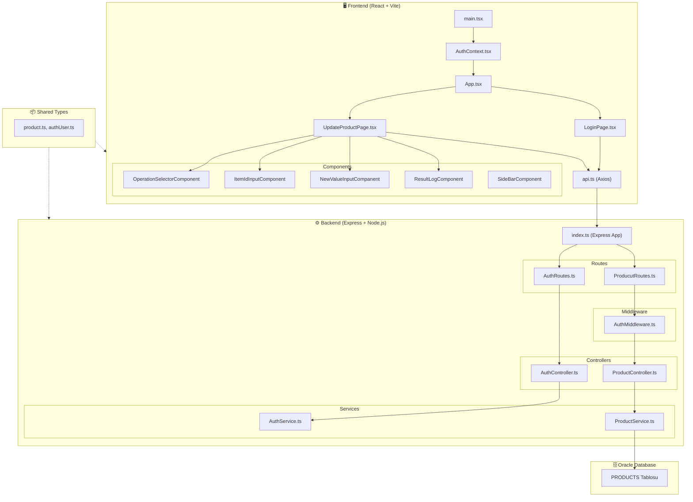
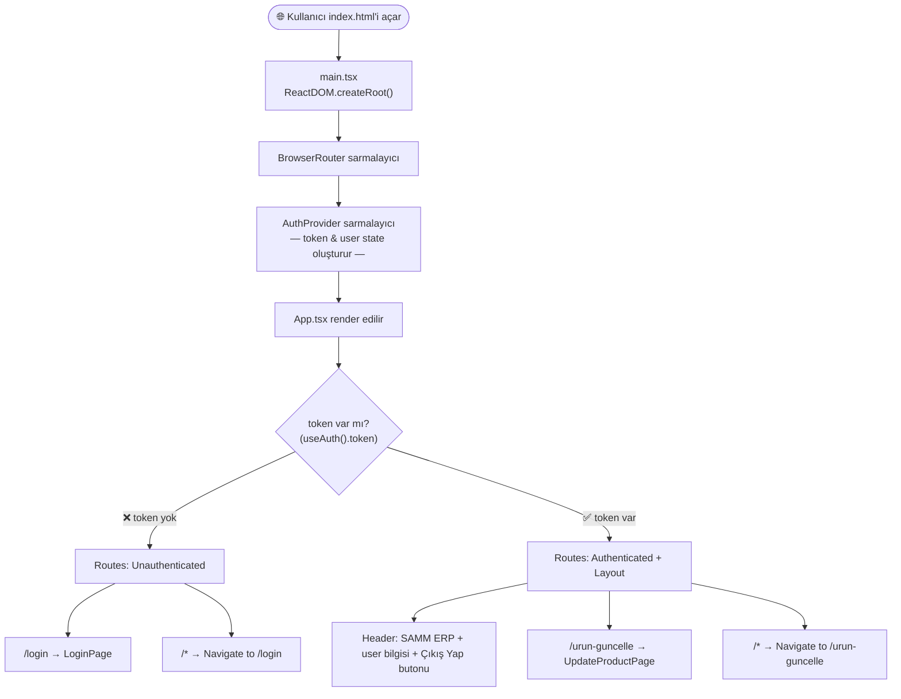
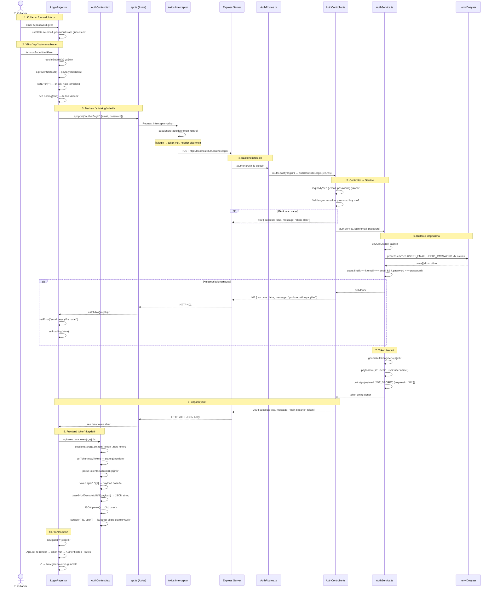
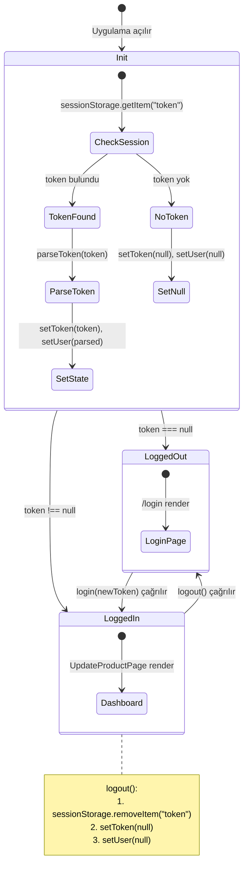
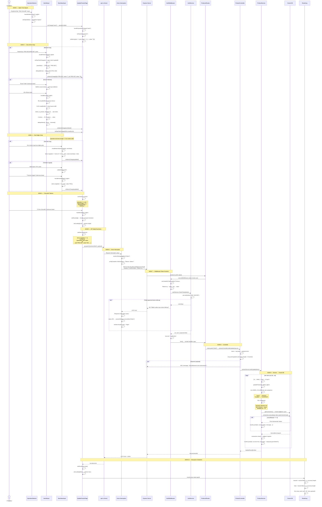
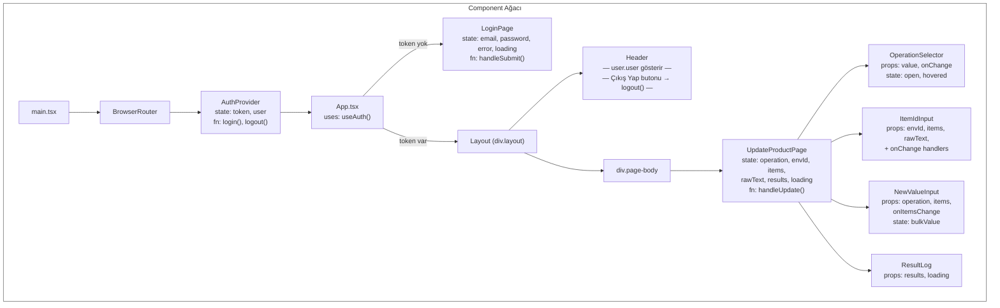
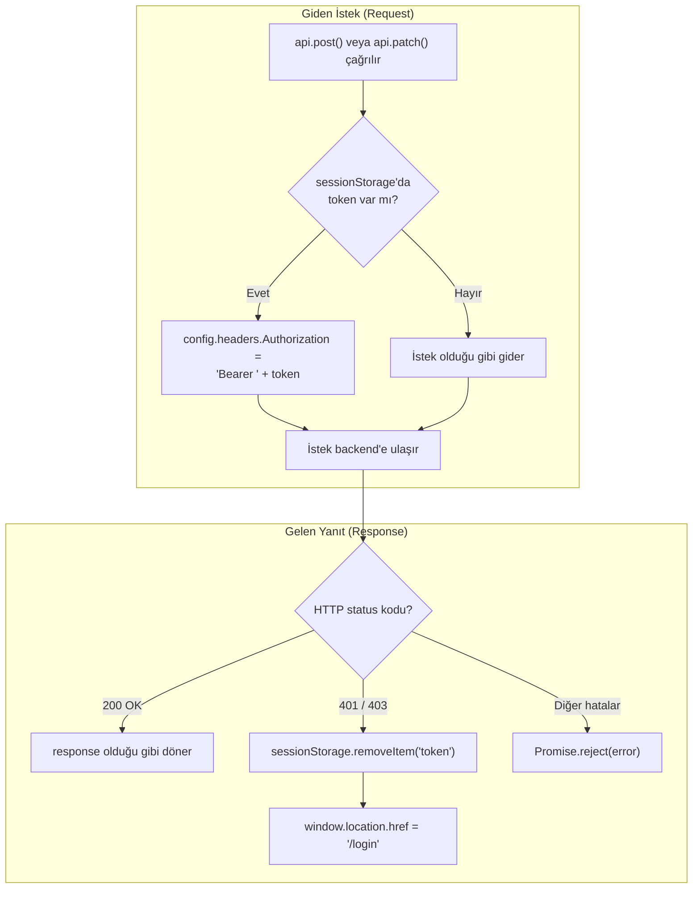
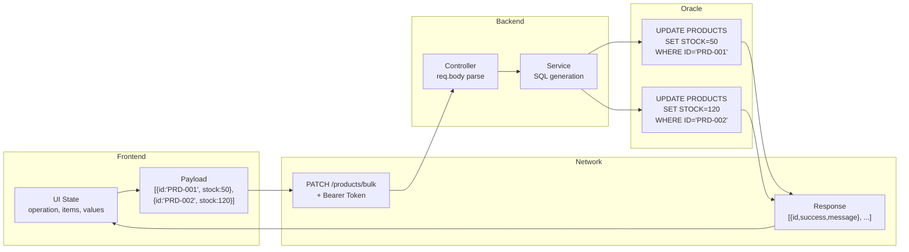
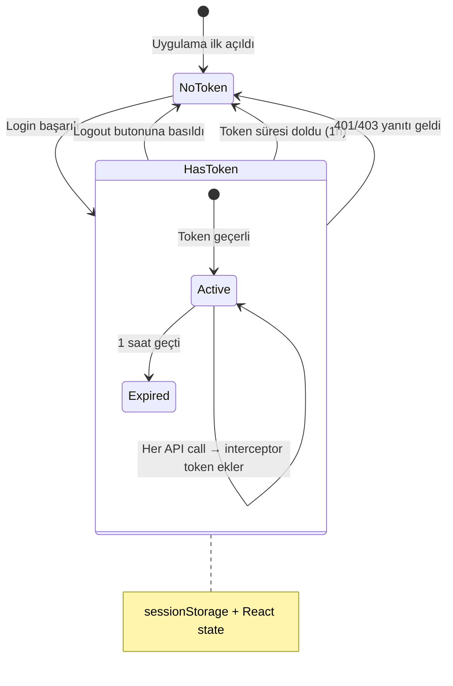

# SAMM ERP — Uygulama Akış Şeması & Mimari Dokümanı

## 1. Genel Mimari Yapı - grafikler için uzantılardan Markdown Preview Mermaid Support indir

---

## 2. Uygulama Başlatma ve Routing Akışı

---

## 3. Login Akışı — Adım Adım

Bu diyagram login butonuna basıldığında tüm fonksiyon çağrı zincirini gösterir:

---

## 4. AuthContext — State Yönetimi Detayı

---

## 5. Toplu Ürün Güncelleme — Tam Akış

Bu diyagram "Toplu Güncelleme" butonuna basıldığında neler olduğunu baştan sona gösterir:

---

## 6. Component Hiyerarşisi ve Prop Akışı

### Prop Akış Tablosu

| Parent → Child                            | Prop                                            | Açıklama                                             |
| ----------------------------------------- | ----------------------------------------------- | ---------------------------------------------------- |
| `UpdateProductPage` → `OperationSelector` | `value`                                         | Seçili işlem türü (`"stock"` veya `"location"`)      |
| `UpdateProductPage` → `OperationSelector` | `onChange`                                      | `handleOperationChange()` — seçim değişince çağrılır |
| `UpdateProductPage` → `ItemIdInput`       | `envId, items, rawText`                         | Input state'leri                                     |
| `UpdateProductPage` → `ItemIdInput`       | `onEnvIdChange, onItemsChange, onRawTextChange` | State güncelleyiciler                                |
| `UpdateProductPage` → `NewValueInput`     | `operation, items, onItemsChange`               | İşlem türü ve ürün listesi                           |
| `UpdateProductPage` → `ResultLog`         | `results, loading`                              | Sonuçlar ve loading durumu                           |

---

## 7. Backend Katman Mimarisi

```mermaid
flowchart LR
    subgraph REQUEST["HTTP İsteği"]
        REQ["PATCH /products/bulk<br/>Header: Authorization: Bearer ey...<br/>Body: [{id,stock}, ...]"]
    end

    subgraph LAYER1["1️⃣ Route Katmanı"]
        direction TB
        R1["index.ts<br/>app.use('/products', productRoutes)"]
        R2["ProducutRoutes.ts<br/>router.patch('/bulk', ...)"]
    end

    subgraph LAYER2["2️⃣ Middleware Katmanı"]
        M1["AuthMiddleware.ts<br/>securityMiddleware()"]
        M2["Token kontrolü<br/>jwt.verify()"]
    end

    subgraph LAYER3["3️⃣ Controller Katmanı"]
        C1["ProductController.ts<br/>bulkUpdate(req, res)"]
        C2["Validasyon<br/>Array.isArray? length>0?"]
    end

    subgraph LAYER4["4️⃣ Service Katmanı"]
        S1["ProductService.ts<br/>bulkUpdate(items)"]
        S2["updateProduct(id, fields)<br/>SQL oluşturma"]
    end

    subgraph LAYER5["5️⃣ Database"]
        DB["Oracle DB<br/>PRODUCTS tablosu<br/>UPDATE ... SET ... WHERE ..."]
    end

    REQ --> R1 --> R2 --> M1 --> M2 --> C1 --> C2 --> S1 --> S2 --> DB
```

---

## 8. Axios Interceptor Akışı

---

## 9. Dosya Bazında Fonksiyon Referansı

### Frontend

| Dosya                                                                                                                          | Fonksiyon                        | Tetikleyici                   | Ne Yapar                                        |
| ------------------------------------------------------------------------------------------------------------------------------ | -------------------------------- | ----------------------------- | ----------------------------------------------- |
| [LoginPage.tsx](file:///c:/Users/EMRE/Desktop/calisma/frontend/src/pages/LoginPage.tsx)                                        | `handleSubmit(e)`                | Form submit                   | Email/password → backend POST → login()         |
| [AuthContext.tsx](file:///c:/Users/EMRE/Desktop/calisma/frontend/src/context/AuthContext.tsx)                                  | `login(newToken)`                | LoginPage handleSubmit        | Token'ı sessionStorage + state'e yazar          |
| [AuthContext.tsx](file:///c:/Users/EMRE/Desktop/calisma/frontend/src/context/AuthContext.tsx)                                  | `logout()`                       | Header çıkış butonu           | sessionStorage temizler, state null yapar       |
| [AuthContext.tsx](file:///c:/Users/EMRE/Desktop/calisma/frontend/src/context/AuthContext.tsx)                                  | `parseToken(token)`              | login() içinde                | JWT payload'ı decode eder → {id, user}          |
| [AuthContext.tsx](file:///c:/Users/EMRE/Desktop/calisma/frontend/src/context/AuthContext.tsx)                                  | `base64UrlDecodetoUtf8(input)`   | parseToken() içinde           | Base64 URL decode → UTF-8 string                |
| [UpdateProductPage.tsx](file:///c:/Users/EMRE/Desktop/calisma/frontend/src/pages/UpdateProductPage.tsx)                        | `handleOperationChange(op)`      | OperationSelector onChange    | İşlem türünü set eder, değerleri sıfırlar       |
| [UpdateProductPage.tsx](file:///c:/Users/EMRE/Desktop/calisma/frontend/src/pages/UpdateProductPage.tsx)                        | `handleUpdate()`                 | "Güncelle" button onClick     | Payload oluşturur → api.patch('/products/bulk') |
| [OperationSelectorComponent.tsx](file:///c:/Users/EMRE/Desktop/calisma/frontend/src/components/OperationSelectorComponent.tsx) | `handleSelect(op)`               | Dropdown item click           | Parent'a bildirir + dropdown kapatır            |
| [ItemIdInputComponent.tsx](file:///c:/Users/EMRE/Desktop/calisma/frontend/src/components/ItemIdInputComponent.tsx)             | `handleTextChange(v)`            | Textarea onChange             | parseIds → dedupeItems → parent'a bildir        |
| [ItemIdInputComponent.tsx](file:///c:/Users/EMRE/Desktop/calisma/frontend/src/components/ItemIdInputComponent.tsx)             | `handleExcel(e)`                 | File input onChange           | xlsx parse → ID/value çıkar → parent'a bildir   |
| [ItemIdInputComponent.tsx](file:///c:/Users/EMRE/Desktop/calisma/frontend/src/components/ItemIdInputComponent.tsx)             | `parseIds(text)`                 | handleTextChange içinde       | Text → virgül/newline split → string[]          |
| [ItemIdInputComponent.tsx](file:///c:/Users/EMRE/Desktop/calisma/frontend/src/components/ItemIdInputComponent.tsx)             | `dedupeItems(items)`             | handleTextChange, handleExcel | Aynı ID'li item'ları tekli yapar                |
| [ItemIdInputComponent.tsx](file:///c:/Users/EMRE/Desktop/calisma/frontend/src/components/ItemIdInputComponent.tsx)             | `removeItem(id)`                 | Chip X butonu                 | Listeden tek item siler                         |
| [NewValueInputCompanent.tsx](file:///c:/Users/EMRE/Desktop/calisma/frontend/src/components/NewValueInputCompanent.tsx)         | `handleItemValueChange(id, val)` | Satır input onChange          | Tek item'ın value'sunu günceller                |
| [NewValueInputCompanent.tsx](file:///c:/Users/EMRE/Desktop/calisma/frontend/src/components/NewValueInputCompanent.tsx)         | `handleHandleApply()`            | "Tümüne Uygula" butonu        | bulkValue'yu tüm item'lara yazar                |
| [api.ts](file:///c:/Users/EMRE/Desktop/calisma/frontend/src/api.ts)                                                            | Request Interceptor              | Her API çağrısı öncesi        | Token varsa Authorization header ekler          |
| [api.ts](file:///c:/Users/EMRE/Desktop/calisma/frontend/src/api.ts)                                                            | Response Interceptor             | Her API yanıtı sonrası        | 401/403 → login'e yönlendir                     |

### Backend

| Dosya                                                                                                     | Fonksiyon                   | Tetikleyici               | Ne Yapar                                        |
| --------------------------------------------------------------------------------------------------------- | --------------------------- | ------------------------- | ----------------------------------------------- |
| [AuthController.ts](file:///c:/Users/EMRE/Desktop/calisma/backend/src/controller/AuthController.ts)       | `login(req, res)`           | POST /auther/login        | Validasyon → AuthService.login() → token döner  |
| [AuthService.ts](file:///c:/Users/EMRE/Desktop/calisma/backend/src/service/AuthService.ts)                | `login(email, pass)`        | AuthController            | .env'den kullanıcı bul → token üret             |
| [AuthService.ts](file:///c:/Users/EMRE/Desktop/calisma/backend/src/service/AuthService.ts)                | `EnvGetUsers()`             | login() içinde            | .env'den USER1*, USER2* vb. okur                |
| [AuthService.ts](file:///c:/Users/EMRE/Desktop/calisma/backend/src/service/AuthService.ts)                | `generateToken(user)`       | login() içinde            | jwt.sign() ile 1 saatlik token üretir           |
| [AuthService.ts](file:///c:/Users/EMRE/Desktop/calisma/backend/src/service/AuthService.ts)                | `CheckTicket(token)`        | AuthMiddleware            | jwt.verify() → payload veya null                |
| [AuthMiddleware.ts](file:///c:/Users/EMRE/Desktop/calisma/backend/src/middleware/AuthMiddleware.ts)       | `securityMiddleware`        | Product route'ları öncesi | Authorization header → token doğrula → next()   |
| [ProductController.ts](file:///c:/Users/EMRE/Desktop/calisma/backend/src/controller/ProductController.ts) | `updateProduct(req, res)`   | PATCH /products/:id       | Tek ürün güncelleme                             |
| [ProductController.ts](file:///c:/Users/EMRE/Desktop/calisma/backend/src/controller/ProductController.ts) | `bulkUpdate(req, res)`      | PATCH /products/bulk      | Toplu güncelleme → ProductService               |
| [ProductService.ts](file:///c:/Users/EMRE/Desktop/calisma/backend/src/service/ProductService.ts)          | `getConnection()`           | updateProduct() içinde    | Oracle'a bağlantı açar                          |
| [ProductService.ts](file:///c:/Users/EMRE/Desktop/calisma/backend/src/service/ProductService.ts)          | `updateProduct(id, fields)` | bulkUpdate() loop içinde  | SQL oluştur → Oracle execute → connection close |
| [ProductService.ts](file:///c:/Users/EMRE/Desktop/calisma/backend/src/service/ProductService.ts)          | `bulkUpdate(items)`         | ProductController         | Her item için updateProduct() çağırır           |

---

## 10. Veri Akışı Özeti (Data Flow)

---

## 11. Token Yaşam Döngüsü

> [!TIP]
> Bu dokümanı Mermaid destekleyen herhangi bir markdown viewer'da (VS Code, GitHub, Notion vb.) açarak diyagramları görsel olarak görebilirsin.
